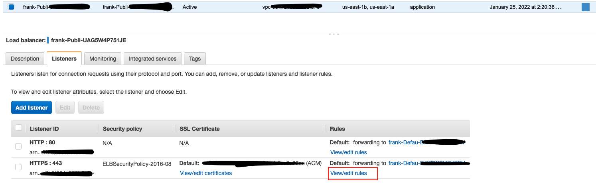
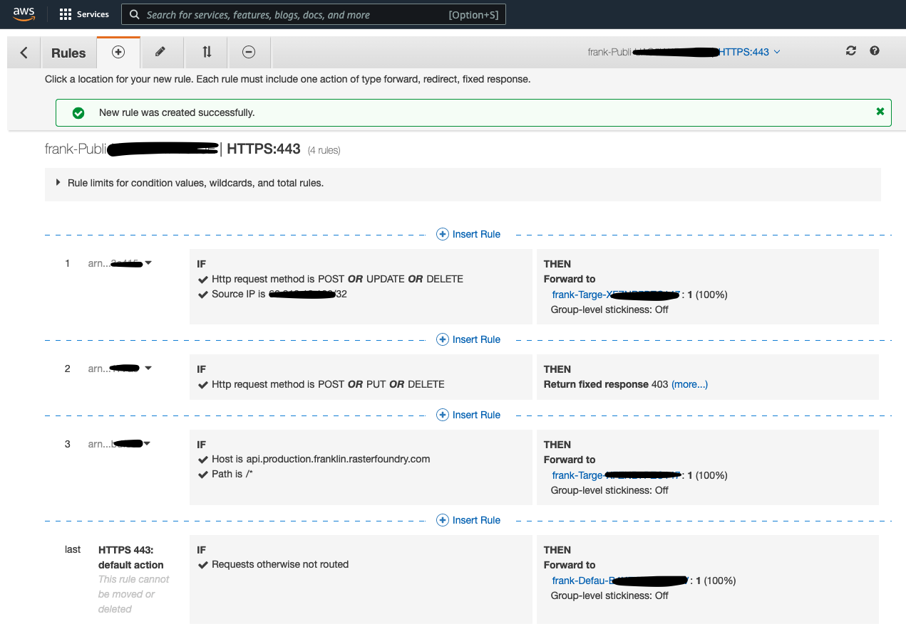

# Use AWS Copilot CLI for Deployment

Deployment using [AWS Copilot CLI](https://aws.github.io/copilot-cli/) is a quick and straightforward way to deploy Franklin API attached by an RDS instance of the PostgreSQL DB to your AWS infrastructure. This document shows you steps of how to use this CLI to deploy your own Franklin APIs as a load-balanced web service, with some suggested configurations added in addition to the default settings. In the end, it will provision an Application Load Balancer, security groups, an ECS service on Fargate to run `api` service, and attach a provisioned PostgreSQL RDS instance. It will add a CDN in front of the tile request endpoints as well.

## Prerequisites
- [AWS Copilot CLI](https://aws.github.io/copilot-cli/docs/overview/)
- [AWS CLI](https://aws.amazon.com/cli/)
- [Docker](https://www.docker.com/products/docker-desktop)
- A named profile configured (`aws configure --profile <your profile name>`) to specify which AWS account and region to deploy your service. For docs, see more [here](https://docs.aws.amazon.com/cli/latest/reference/configure/)
- A domain name registered with Amazon Route 53 in your account. If you do not have one, please follow steps [in the official docs](https://docs.aws.amazon.com/Route53/latest/DeveloperGuide/domain-register.html).

## Instructions
1. `copilot app init franklin --domain <your registered DomainName here>`
    
    - It is required that you have a registered domain name in Amazon Route53 before this step.
    - After going through this tutorial, your load balanced franklin API service is going to be accessible publicly through `${Service}.${Environment}.${Application}.${Domain}`.
    - Under the hood, this step will create a new app called `franklin` and will configure the your AWS admininistration roles to enable use of AWS CloudFormation StackSets.
    - Locally, this step will create a `./copilot` directory and a `./copilot/.workspace` file to track information needed for copilot itself.
    - If this step is successful, you may see the following. I used `rasterfoundry.com` domain in this example.
        ```
        ✔ Created the infrastructure to manage services and jobs under application franklin.. 
        ✔ The directory copilot will hold service manifests for application franklin.
        ```

2. `copilot init`

    - Run the following command, it will:
      - initialize the infra to manage the containerized services for the `franklin` application's `api` service as a `Load Balanced Web Service`. Note that `--port 9090` is needed.
      - set up an ECR repository for the image to be uploaded
      - create a `./copilot/api/manifest.yml` file that we will configure further locally. 
      ```
      $ copilot init -a franklin --dockerfile ./Dockerfile --name api --port 9090 -t "Load Balanced Web Service"
      ```
    - At the end, when it asks if to deploy to a test environment, answer `N`, as we will need to configure more.
    - If this step is successful, you may see the following.
        ```
        ✔ Created the infrastructure to manage services and jobs under application franklin.. 
        ✔ The directory copilot will hold service manifests for application franklin.
        ✔ Wrote the manifest for service api at copilot/api/manifest.yml
        Your manifest contains configurations like your container size and port (:9090).
        ✔ Created ECR repositories for service api.. 
        All right, you're all set for local development.
        Deploy: No
        ```
    
    
3. Override the default template

    - In this step, we will override the auto generated `manifest.yml` template so that we will configure the infra further. Run the following commands.
        ```
        rm ./copilot/api/manifest.yml
        cp manifest.yml ./copilot/api/manifest.yml
        ```
    - Here are what changed under the hood:
      - Add the container start up command:
       
        - Add the following line to the `./copilot/api/manifest.yml` file, which is the command to run in the container using the `entrypoint` provided by the image.
        - Please make sure that this config is a top-level configuration in `./copilot/api/manifest.yml`, e.g. a good spot to add this line should be in a new line after line `exec: true` in the manifest file.
        - Please also replace the `<your DomainName here>` part, e.g. for this example tutorial, `rasterfoundry.com` domain name is available in Route53 under my AWS account.

        ```
        command: ["serve", "--with-transactions", "--with-tiles", "--run-migrations", "--external-port", "443", "--api-scheme", "https", "--api-host", "api.franklin.<your DomainName here>"]
        ```
      - CPU and Memory configurations:
        ```
        cpu: 4096
        memory: 8192
        ```
      - Auto scaling:
        ```
        count:
            range: 1-10
            cpu_percentage: 70
            memory_percentage: 80
            requests: 10000
            response_time: 2s
        ```

4. Attach a provisioned RDS Postgres 12.7 instance and give ECS task access to S3

    - The provisioned RDS instance we will use is of Postgres engine 12.7, which supports the PostGIS version 3.X since the tile rendering endpoints needs methods from this version of PostGI.S
    - Additionally, the ECS task role needs some additional policies attached so that it has S3 access.
    - Run the following commands to ensure the above two.
    ```
    mkdir ./copilot/api/addons
    cp db.yml ./copilot/api/addons/db.yml
    cp iam.yml ./copilot/api/addons/iam.yml
    ```

5. `copilot env init -n production -a franklin`

    - This command will create a new environment `production` where the serivces will live.
    - After answering the questions as below, it will:
      - link your named profile to the application to be deployed
      - create the common infrastructure that's shared between the services such as a VPC
      - an Application Load Balancer
      - an ECS Cluster
      - etc
     - Under the hood, on CloudFormation, it wil create a stack for cross-regional resources to support the CodePipeline for this workspace, and a stack for the environment template for infrastructure shared among Copilot workloads for this application.
    ```
    $ copilot env init -n production -a franklin
    Credential source: [profile default]
    Default environment configuration? Yes, use default.
    ```
    - If this step is successful, you may see the following.
    ```
    ✔ Proposing infrastructure changes for the franklin-production environment. 
      - Creating the infrastructure for the franklin-production environment.   [create complete]  [150.9s]
        - An IAM Role for AWS CloudFormation to manage resources               [create complete]  [17.0s]
        - An ECS cluster to group your services                                [create complete]  [12.7s]
        - Delegate DNS for environment subdomain                               [create complete]  [36.0s]
        - Enable long ARN formats for the authenticated AWS principal          [create complete]  [3.6s]
        - An IAM Role to describe resources in your environment                [create complete]  [15.7s]
        - A security group to allow your containers to talk to each other      [create complete]  [9.0s]
        - Request and validate an ACM certificate for your domain              [create complete]  [45.7s]
        - An Internet Gateway to connect to the public internet                [create complete]  [18.0s]
        - Private subnet 1 for resources with no internet access               [create complete]  [20.6s]
        - Private subnet 2 for resources with no internet access               [create complete]  [19.2s]
        - Public subnet 1 for resources that can access the internet           [create complete]  [20.6s]
        - Public subnet 2 for resources that can access the internet           [create complete]  [20.6s]
        - A Virtual Private Cloud to control networking of your AWS resources  [create complete]  [21.4s]
      ✔ Created environment production in region us-east-1 under application franklin.
    ```

6. Add CDN in front of tile endpoint requests

    6.1 Get the `CertificateArn` from the subdomain

    - The previous step should create a certificate in AWS certificate manager (ACM) for the subdomain `production.franklin.<your domain name>`, which in this example, `production.franklin.rasterfoundry.com`. 
    - We want to add an alias (`A` record) for the deployed CDN in front of the tile requests rather than using an URL auto generated by CloudFront.
    - This will require us to let CloudFormation know what certificate to use for this alias.
    - So, replace `<your aws profile name>` with the AWS profile you chose from the last step, and run the following commands. The first line specifies with AWS profile to use. The second command lists the existing certificates in your account, which should include the one created for the subdomain from the previous steps
    - In the response, copy the `CertificateArn` field from the response that has `DomainName` as `production.franklin.<your domain name>`. Save this somewhere as it will be used in the next steps.

    ```
    export AWS_PROFILE=<your aws profile name>
    aws acm list-certificates
    ```
    
    6.2 Add the CDN config

    The provided configuration template should put a CDN in front of tile API endpoints.

    ```
    cp cdn.yml ./copilot/api/addons/cdn.yml
    ```

    6.3 Provide default values for the CDN config
    
    - Override the following fields on top of the parameter list: `CertArn` and `LoggingBucket` parameters in `./copilot/api/addons/cdn.yml`.
    - Use the `CertificateArn` saved from step 6.1 in the following example. Also note that you should use a logging bucket on S3 that your account has access to.
    ```
    CertArn:
        Type: String
        Description: The arn of the certificate created for your DNS
        Default: <the Certificate ARN you copied from step 6.1>
    LoggingBucket:
        Type: String
        Description: The bucket for the CDN logs
        Default: <the S3 bucket URL for the CDN logs, e.g. rasterfoundry-production-logs-us-east-1.s3.amazonaws.com>
    ```

7. `copilot deploy -a franklin -e production -n api`

    - This command will package the `manifest.yml` file and addons into `CloudFormation`, and create and/or update the ECS task definition and attached service.
    - Under the hood, this will create a stack that manages the franklin production API service, and the nested stack attached to the API service for DB and IAM role policy for the ECS task.
    - If all goes well, it should show something like the following in the end. 
    ```
   ✔ Proposing infrastructure changes for stack franklin-production-api 
   - Creating the infrastructure for stack franklin-production-api                   [create complete]  [1162.0s]
     - An Addons CloudFormation Stack for your additional AWS resources              [create complete]  [947.6s]
       - A security group for your DB cluster                                        [create complete]  [6.6s]
       - DB cluster                                                                  [create complete]  [613.8s]
       - A Secrets Manager secret to store your DB credentials                       [create complete]  [0.0s]
       - A security group for your workload to access the DB cluster                 [create complete]  [4.0s]
     - An autoscaling target to scale your service's desired count                   [create complete]  [3.3s]
     - Service discovery for your services to communicate within the VPC             [create complete]  [1.6s]
     - Update your environment's shared resources                                    [update complete]  [219.2s]
       - A security group for your load balancer allowing HTTP and HTTPS traffic     [create complete]  [7.4s]
       - An Application Load Balancer to distribute public traffic to your services  [create complete]  [184.4s]
     - An IAM Role for the Fargate agent to make AWS API calls on your behalf        [create complete]  [16.5s]
     - A CloudWatch log group to hold your service logs                              [create complete]  [5.1s]
     - An ECS service to run and maintain your tasks in the environment cluster      [create complete]  [99.6s]
       Deployments                                                                                       
                  Revision  Rollout      Desired  Running  Failed  Pending                                       
         PRIMARY  30        [completed]  1        1        0       0                                             
     - A target group to connect the load balancer to your service                   [create complete]  [1.6s]
     - An ECS task definition to group your containers and run them on ECS           [create complete]  [4.4s]
     - An IAM role to control permissions for the containers in your tasks           [create complete]  [15.9s]
   ✔ Deployed service api.
   Recommended follow-up action:
       You can access your service at https://api.production.franklin.rasterfoundry.com over the internet.
    ```

8.  Some commands to check the service
    - `copilot svc show -a franklin -n api`: This command shows info about the deployed services, including the endpoints, capacity and related resources per environment.
    - `copilot svc status -a franklin -n api -e production`: This command shows the health statuses, e.g. service status, task status, and related CloudWatch alarms etc.
    - `copilot svc logs -a franklin -n api -e production`: This command shows the the logs of the deployed service.

## How to take down the deployed Franklin API server?

`copilot app delete franklin`

## How to add IP whitelist for Create, Update, Deletion actions for all endpoints?

We suggest adding Load Balancer Listerner rules either through the AWS console or CLI. The following steps show you an example for such modifications through the AWS console.

1. From the EC2 console, go to the load balancers on the sidebar. Select the load balancer for Franklin. Switch to the `Listeners` tab shown as the following. Click on the `View/edit rules` link.



2. On the rules edit page, click on `Insert Rule` link to add the following two rules on top to the existing rules. This will limit `POST`, `UPDATE`, `DELETE` actions to specific IPs.



## How to use the tile endpoint to serve ZXY tiles?

The idea is to create a collection and add one or more items to this collection. Then create a mosaic definition that includes one or more items from this collection. In the end, use the mosaic definition ID in the `/tiles` API endpoint along with some query parameters to serve ZXY tiles.

An item should have assets that point to S3 URL of a COG. This S3 location should be either public or on the same AWS infrastructure where you deployed your Franklin instance.

We'd recommend using the following command to create a COG from a non-COG geotiff:

```
gdal_translate <tif_path> -co TILING_SCHEME=GoogleMapsCompatible -co COMPRESS=DEFLATE -co BIGTIFF=IF_SAFER -of COG <out_path>
```

- Create a `demo` collection
    ```
    curl --location --request POST 'https://api.production.franklin.rasterfoundry.com/collections' \
    --header 'Content-Type: application/json' \
    --data-raw '{
        "assets": {},
        "description": "Demo  STAC collection",
        "extent": {
            "spatial": {
                "bbox": [
                    [
                        0,
                        0,
                        10,
                        10
                    ]
                ]
            },
            "temporal": {
                "interval": [
                    [
                        null,
                        null
                    ]
                ]
            }
        },
        "id": "demo",
        "keywords": [],
        "license": "proprietary",
        "links": [],
        "properties": {},
        "providers": [],
        "stac_extensions": [],
        "stac_version": "1.0.0",
        "summaries": {},
        "type": "Collection"
    }'
    ```
- Add a `cog` item to the `demo` collection:
    ```
    curl --location --request POST 'https://api.production.franklin.rasterfoundry.com/collections/demo/items' \
    --header 'Content-Type: application/json' \
    --data-raw '{
    "id": "cog",
    "stac_version": "1.0.0",
    "stac_extensions": [],
    "type": "Feature",
    "geometry": {
        "type": "Polygon",
        "coordinates": [
        [
            [
            -15.0002052,
            28.9282827
            ],
            [
            -15.0002033,
            27.9371483
            ],
            [
            -13.8842036,
            27.9326277
            ],
            [
            -13.8737609,
            28.9235723
            ],
            [
            -15.0002052,
            28.9282827
            ]
        ]
        ]
    },
    "bbox": [
        -15.002052,
        27.9326277,
        -13.8737609,
        28.9282827
    ],
    "links": [],
    "assets": {
        "data": {
        "href": "s3://rasterfoundry-production-data-us-east-1/demo-data/s2-canary-islands-rgb-cog.tif",
        "title": "RGB COG from Sentinel-2 bands",
        "description": "Composite image from bands 4, 3, and 2 of a Sentinel-2 image over the Canary Islands",
        "roles": ["data"],
        "type": "image/tiff; application=geotiff; profile=cloud-optimized" 
        }
    },
    "collection": "demo",
    "properties": {
        "datetime": "2021-06-16T00:00:00Z"
    }
    }'
    ```
- Create mosaic definition that includes this item from the collection
    ```
    curl --location --request POST 'https://api.production.franklin.rasterfoundry.com/collections/demo/mosaic' \
    --header 'Content-Type: application/json' \
    --data-raw '{
        "id": "1b01d712-67ee-4b26-8c59-a9b412f343de",
        "description": null,
        "center": [
            -16.16291,
            28.2916,
            14
        ],
        "items": [
            {
                "itemId": "cog",
                "assetName": "data"
            }
        ],
        "minZoom": 2,
        "maxZoom": 30,
        "bounds": [
            -15.002052,
            27.9326277,
            -13.8737609,
            28.9282827
        ]
    }
    '
    ```
- View the tiles from CDN

    - Use QGIS or on geojson.io, use the following URL to view the CDN deployed version of the zxy tiles:

    ```
    https://tiles-cdn.production.franklin.rasterfoundry.com/tiles/collections/demo/mosaic/1b01d712-67ee-4b26-8c59-a9b412f343de/WebMercatorQuad/{z}/{x}/{y}?lowerQuantile=2&upperQuantile=95
    ```
    - Note that the following query parameters are available for this endpoint:
      - `redBand`: a 0-indexed integer representing the band index for red color
      - `greenBand`: a 0-indexed integer representing the band index for green color
      - `blueBand`: a 0-indexed integer representing the band index for blue color
      - `upperQuantile`: histogram clipping upper quantile
      - `lowerQuantile`: histogram clipping lower quantile

    

