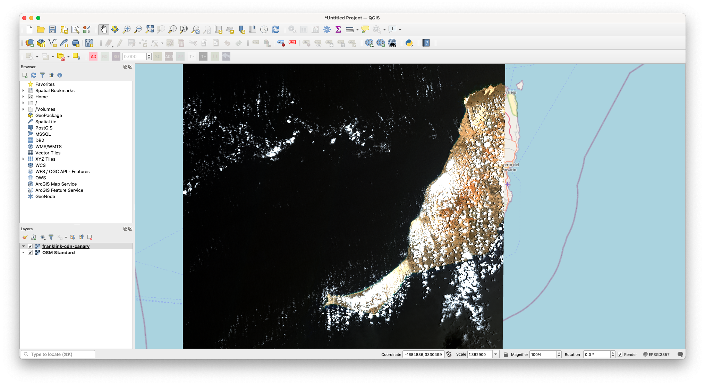

# Use AWS Copilot CLI for Deployment

Deployment using [AWS Copilot CLI](https://aws.github.io/copilot-cli/) is a quick and straightforward way to deploy Franklin API attached by an RDS instance of the PostgreSQL DB to your AWS infrastructure. This document shows you steps of how to use this CLI to deploy your own Franklin APIs as a load-balanced web service, with some suggested configurations added in addition to the default settings. In the end, it willl provision an Application Load Balancer, security groups, an ECS service on Fargate to run `api` service, and attach a provisioned PostgreSQL RDS instance. It will add a CDN in front of the tile request endpoints as well.

## Prerequisites
- [AWS Copilot CLI](https://aws.github.io/copilot-cli/docs/overview/)
- [AWS CLI](https://aws.amazon.com/cli/)
- A named profile configured (`aws configure --profile <your profile name>`) to specify which AWS account and region to deploy your service
- A domain name registered with Amazon Route 53 in your account

## Instructions
1. `copilot app init franklin --domain <your registered DomainName here>`
    
    It is required that you have a registered domain name in Amazon Route53 before this step. After going through this tutorial, your load balanced franklin API service is going to be accessible publicly through `${ServiceName}.${EnvironmentName}.${ApplicationName}.${DomainName}`. Please refer to [here](https://aws.github.io/copilot-cli/docs/developing/domain/#how-do-i-configure-an-alias-for-my-service) if you want to configure an alias for your franklin api service. Under the hood, this step will configure the your AWS admininistration roles to enable use of AWS CloudFormation StackSets.

    ```
    Use existing application: No
    Application name: franklin
    ```

2. `copilot init`

    Run the following command, it will initialize the infra to manage the containerized services, set up an ECR repository for the image to be uploaded, and will create a `./api/manifest.yml` file that we will configure further. At the end, when it asks if to deploy to a test environment, answer `N`.
    
    ```
    $ copilot init -a franklin --dockerfile ./Dockerfile --name api --port 9090 -t "Load Balanced Web Service"
    ```

3. Override the template

    In this step, we will override the auto generate `manifest.yml` template so that we will configure the infra further. Run the following command.

    ```
    rm ./api/manifest.yml
    cp manifest.yml ./api/manifest.yml
    ```

    Here are what changed under the hood:
    - Add the container start up command:

        Add the following line to the `./api/manifest.yml` file, which is the command to run in the container using the `entrypoint` provided by the image. Please make sure that this config is a top-level configuration in `./api/manifest.yml`, e.g. a good spot to add this line should be in a new line after line `exec: true` in the manifest file. Please also replace the `<your DomainName here>` part, e.g. for this example tutorial, `rasterfoundry.com` domain name is available in Route53 under my AWS account.

        ```
        command: ["serve", "--with-transactions", "--with-tiles", "--run-migrations", "--external-port", "443", "--api-scheme", "https", "--api-host", "api.franklin.<your DomainName here>"]
        ```
    
    - Auto scaling:

        ```
        count:
            range: 1-10
            cpu_percentage: 70
            memory_percentage: 80
            requests: 10000
            response_time: 2s
        ```

4. Attach a provisioned RDS Postgres 12.7 instance and give ECS task access to S3

    The provisioned RDS instance we will use is of Postgres engine 12.7, which supports the PostGIS version 3.X since the tile rendering endpoints needs methods from this version of PostGIS. Additionally, the ECS task role needs some additional policies attached so that it has S3 access.

    ```
    mkdir api/addons
    cp db.yml api/addons/db.yml
    cp iam.yml api/addons/iam.yml
    ```

5. `copilot env init -n production`

    This will create a new environment where the serivces will live. After answering the questions as below, it will link your named profile to the application to be deployed, create the common infrastructure that's shared between the services such as a VPC, an Application Load Balancer, and an ECS Cluster etc. Under the hood, on CloudFormation, it wil create a stack for cross-regional resources to support the CodePipeline for this workspace, and a stack for the environment template for infrastructure shared among Copilot workloads for this application.

    ```
    $ copilot env init -n production
    Credential source: [profile default]
    Default environment configuration? Yes, use default.
    ```

6. Add CDN in front of tile endpoint requests

    (1) The previous step should create a certificate in AWS certificate manager (ACM) for the subdomain `production.franklin.<your domain name>`, which in this example, `production.franklin.rasterfoundry.com`. We want to add an alias (`A` record) for the deployed CDN in front of the tile requests rather than using an URL auto generated by CloudFront. This will require us to let CloudFormation know what certificate to use for this alias. So, use the AWS profile you chose from the last step, and copy the `CertificateArn` field from the response that has `DomainName` as `production.franklin.<your domain name>`.

    ```
    export AWS_PROFILE=<your aws profile name>
    aws acm list-certificates
    ```
    
    (2) Copy the CDN config to the `./api/addons` directory

    ```
    cp cdn.yml api/addons/cdn.yml
    ```

    (3) Provide default values to `CertArn` and `LoggingBucket` parameters in `api/addons/cdn.yml`. E.g.:

    ```
    CertArn:
        Type: String
        Description: The arn of the certificate created for your DNS
        Default: <the Certificate ARN you copied from step (1)>
    LoggingBucket:
        Type: String
        Description: The bucket for the CDN logs
        Default: <the S3 bucket URL for the CDN logs, e.g. rasterfoundry-production-logs-us-east-1.s3.amazonaws.com>
    ```

7. `copilot deploy`

    This command will package the `manifest.yml` file and addons into `CloudFormation`, and create and/or update the ECS task definition and service. If all goes well, it should show something like the following in the end. Under the hood, this will create a stack that manages the franklin production API service, and the nested stack attached to the API service for DB and IAM role policy for the ECS task.

    ```
    $ copilot deploy
    Only found one workload, defaulting to: api
    Only found one environment, defaulting to: production
    Environment production is already on the latest version v1.6.1, skip upgrade.
    ✔ Proposing infrastructure changes for stack franklin-production-api 
    - Creating the infrastructure for stack franklin-production-api                   [create complete]  [967.6s]
    - An Addons CloudFormation Stack for your additional AWS resources              [create complete]  [825.8s]
        - A security group for your DB cluster                                        [create complete]  [8.1s]
        - DB cluster                                                                  [create complete]  [519.6s]
        - A Secrets Manager secret to store your DB credentials                       [create complete]  [3.1s]
        - A security group for your workload to access the DB cluster                 [create complete]  [6.7s]
    - An autoscaling target to scale your service's desired count                   [create complete]  [0.0s]
    - Service discovery for your services to communicate within the VPC             [create complete]  [3.5s]
    - Update your environment's shared resources                                    [update complete]  [186.5s]
        - A security group for your load balancer allowing HTTP and HTTPS traffic     [create complete]  [7.4s]
        - An Application Load Balancer to distribute public traffic to your services  [create complete]  [157.0s]
    - An IAM Role for the Fargate agent to make AWS API calls on your behalf        [create complete]  [15.0s]
    - A CloudWatch log group to hold your service logs                              [create complete]  [3.5s]
    - An ECS service to run and maintain your tasks in the environment cluster      [create complete]  [79.6s]
        Deployments                                                                                       
                Revision  Rollout      Desired  Running  Failed  Pending                                       
        PRIMARY  27        [completed]  1        1        0       0                                             
    - A target group to connect the load balancer to your service                   [create complete]  [3.5s]
    - An ECS task definition to group your containers and run them on ECS           [create complete]  [4.1s]
    - An IAM role to control permissions for the containers in your tasks           [create complete]  [17.4s]
    ✔ Deployed service api.
    Recommended follow-up action:
        You can access your service at https://api.production.franklin.rasterfoundry.com over the internet.
    ```

8.  Some commands to check the service
    - `copilot svc show`: This command shows info about the deployed services, including the endpoints, capacity and related resources per environment.
    - `copilot svc status`: This command shows the health statuses, e.g. service status, task status, and related CloudWatch alarms etc.
    - `copilot svc logs`: This command shows the the logs of the deployed service.

## How to add IP whitelist for Create, Update, Deletion actions for all endpoints?

Currently, the configs in `alb-rules.yml` are not working as expected. Thus, for now, we suggest you add Load Balancer Listerner rules either through the AWS console or CLI.

## How to verify that the deployed APIs are working fine?

- Create a `demo` collection
    ```
    curl --location --request POST 'https://api.production.franklin.rasterfoundry.com/collections' \
    --header 'Content-Type: application/json' \
    --data-raw '{
        "assets": {},
        "description": "Demo  STAC collection",
        "extent": {
            "spatial": {
                "bbox": [
                    [
                        0,
                        0,
                        10,
                        10
                    ]
                ]
            },
            "temporal": {
                "interval": [
                    [
                        null,
                        null
                    ]
                ]
            }
        },
        "id": "demo",
        "keywords": [],
        "license": "proprietary",
        "links": [],
        "properties": {},
        "providers": [],
        "stac_extensions": [],
        "stac_version": "1.0.0",
        "summaries": {},
        "type": "Collection"
    }'
    ```
- Add a `cog` item to the `demo` collection:
    ```
    curl --location --request POST 'https://api.production.franklin.rasterfoundry.com/collections/demo/items' \
    --header 'Content-Type: application/json' \
    --data-raw '{
    "id": "cog",
    "stac_version": "1.0.0",
    "stac_extensions": [],
    "type": "Feature",
    "geometry": {
        "type": "Polygon",
        "coordinates": [
        [
            [
            -15.0002052,
            28.9282827
            ],
            [
            -15.0002033,
            27.9371483
            ],
            [
            -13.8842036,
            27.9326277
            ],
            [
            -13.8737609,
            28.9235723
            ],
            [
            -15.0002052,
            28.9282827
            ]
        ]
        ]
    },
    "bbox": [
        -15.002052,
        27.9326277,
        -13.8737609,
        28.9282827
    ],
    "links": [],
    "assets": {
        "data": {
        "href": "s3://rasterfoundry-production-data-us-east-1/demo-data/s2-canary-islands-rgb-cog.tif",
        "title": "RGB COG from Sentinel-2 bands",
        "description": "Composite image from bands 4, 3, and 2 of a Sentinel-2 image over the Canary Islands",
        "roles": ["data"],
        "type": "image/tiff; application=geotiff; profile=cloud-optimized" 
        }
    },
    "collection": "demo",
    "properties": {
        "datetime": "2021-06-16T00:00:00Z"
    }
    }'
    ```
- Create mosaic definition that includes this item from the collection
    ```
    curl --location --request POST 'https://api.production.franklin.rasterfoundry.com/collections/demo/mosaic' \
    --header 'Content-Type: application/json' \
    --data-raw '{
        "id": "1b01d712-67ee-4b26-8c59-a9b412f343de",
        "description": null,
        "center": [
            -16.16291,
            28.2916,
            14
        ],
        "items": [
            {
                "itemId": "cog",
                "assetName": "data"
            }
        ],
        "minZoom": 2,
        "maxZoom": 30,
        "bounds": [
            -15.002052,
            27.9326277,
            -13.8737609,
            28.9282827
        ]
    }
    '
    ```
- View the tiles from CDN

    Use QGIS or on geojson.io, use the following URL to view the CDN deployed version of the zxy tiles:

    ```
    https://tiles-cdn.production.franklin.rasterfoundry.com/tiles/collections/demo/mosaic/1b01d712-67ee-4b26-8c59-a9b412f343de/WebMercatorQuad/{z}/{x}/{y}?lowerQuantile=2&upperQuantile=95
    ```

    